 

### 🛠️ Technology Stack & Workflows

**Security Monitoring (SIEM):**  
 

**Network Defense & Forensics:**  
 

**Automation & Systems:**  
 

**Threat Intelligence & Detection:** 

 

### 🔬 Featured Security Projects

| Repository | Core Objective | Primary Outcome |
|:--- |:--- |:--- |
| **[Security Analyst Portfolio](https://github.com/gurvinny/security-analyst-portfolio)** | **SOC Methodology** | Sigma Rules, Incident Playbooks, and NIST-aligned Writeups. |
| **[Home Network Lab](https://github.com/gurvinny/home-network-lab)** | **Infrastructure** | Enterprise-grade segmentation and IDS/IPS log aggregation. |
| **[Automated Phish Extractor](https://github.com/gurvinny/Automated-Phish-Extractor)** | **Efficiency/Automation** | Python tool for 30-second IOC extraction and enrichment. |
| **[grv-flipper-lab](https://github.com/gurvinny/grv-flipper-lab)** | **Hardware Security & Research** | Protocol analysis and embedded systems testing. |

 

### 📜 Professional Development

| Certification | Focus Areas | Status |
|:---|:---|:---:|
| **CompTIA Security+** | Threat Management, Cryptography, Identity | **Exam Targeted: May 2026** |
| **THM SOC Level 1** | SIEM, Digital Forensics, Traffic Analysis | **Advanced Standing** |

 

 

🟢 &nbsp; *"The attacker needs to be right once. The defender needs to be right every time."*

