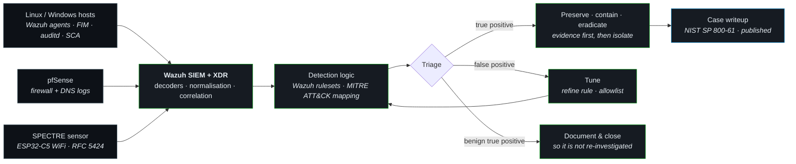

# Gurvin Singh

**CySA+ and Security+ certified blue-team defender.** I build my own SOC, then break it,
investigate it, and harden it. Every step is documented in public.
Open to SOC Analyst and Detection Engineering roles — NYC or remote.

---

### 👻 SPECTRE: WiFi intrusion detection, built end to end

<table>
<tr>
<td width="50%" valign="top">

Two ESP32-C5 boards run custom promiscuous-mode firmware and stream 802.11 frame metadata
over UART into a <b>stdlib-only FastAPI detection engine</b> (deauth flood, evil twin,
beacon/probe flood and RSSI anomaly rules), which forwards scored threats to
<b>Wazuh over RFC 5424</b> and drives a Next.js SOC console.

Sensor to SIEM to analyst view, every layer mine. Two of the four detections map to ATT&amp;CK: <b>T1557</b> (evil twin) and <b>T1499</b> (deauth flood).

<i>Run against my own network only, on hardware I own. The sensor forwards threats and
summaries, <b>never raw frames</b>: the SIEM stores decisions, not a packet archive.</i>

<b><a href="https://github.com/gurvinny/spectre">→ github.com/gurvinny/spectre</a></b>

</td>
<td width="50%" valign="top">

</td>
</tr>
</table>

---

### 🗺️ Where it ships to: the detection pipeline

SPECTRE is one source among several. Everything lands in a self-built SOC running on a single
Proxmox node behind a pfSense perimeter, five VLAN segments, default-deny between them.

```mermaid
flowchart LR
    EP["Linux / Windows hosts<br/><i>Wazuh agents · FIM · auditd · SCA</i>"] --> SIEM
    FWL["pfSense<br/><i>firewall + DNS logs</i>"] --> SIEM
    RF["SPECTRE sensor<br/><i>ESP32-C5 WiFi · RFC 5424</i>"] --> SIEM

    SIEM["<b>Wazuh SIEM + XDR</b><br/>decoders · normalisation · correlation"]
    SIEM --> RULES["Detection logic<br/><i>Wazuh rulesets · MITRE ATT&amp;CK mapping</i>"]
    RULES --> SEV{"Triage"}
    SEV -->|true positive| IR["Preserve · contain · eradicate<br/><i>evidence first, then isolate</i>"]
    SEV -->|false positive| TUNE["Tune<br/><i>refine rule · allowlist</i>"]
    SEV -->|benign true positive| DOC["Document &amp; close<br/><i>so it is not re-investigated</i>"]
    TUNE --> RULES
    IR --> CASE["Case writeup<br/><i>NIST SP 800-61 · published</i>"]

    classDef src fill:#0D1117,stroke:#455A64,color:#E6EDF3
    classDef core fill:#161B22,stroke:#008F11,color:#E6EDF3
    classDef out fill:#161B22,stroke:#0077B5,color:#E6EDF3
    class EP,FWL,RF src
    class SIEM,RULES,IR,TUNE,DOC core
    class CASE out
```

---

### 🔬 More work: *what each project proves*

<table align="center">
<thead>
<tr><th></th><th align="left">Project</th><th align="left">What it proves</th></tr>
</thead>
<tbody>
<tr>
  <td align="center">🛡️</td>
  <td><b><a href="https://github.com/gurvinny/security-analyst-portfolio">Security Analyst Portfolio</a></b></td>
  <td>Detection engineering: IR playbooks · NIST writeups · ATT&amp;CK-mapped detection logic</td>
</tr>
<tr>
  <td align="center">🐍</td>
  <td><b><a href="https://github.com/gurvinny/Automated-Phish-Extractor">Automated Phish Extractor</a></b></td>
  <td>Tier-1 SOC triage: .eml parsing, IOC defang, SPF/DMARC in 30s</td>
</tr>
<tr>
  <td align="center">🛸</td>
  <td><b><a href="https://github.com/gurvinny/pelican-deepfield">Pelican Deepfield</a></b></td>
  <td>Theme plugin for a game-server control panel. Shipping discipline: semver releases, tagged and changelogged</td>
</tr>
<tr>
  <td align="center">🏠</td>
  <td><b><a href="https://github.com/gurvinny/home-network-lab">Home Network Lab</a></b></td>
  <td>Defense-in-depth: VLAN segmentation · default-deny routing · centralized logging</td>
</tr>
</tbody>
</table>

---

### 🔧 Recent work

<pre>
╔════════════════════════════════════════════════════════════╗
║ HARDENING SPECTRE supply chain + code scanning             ║
║           2026-09-12 -> 2026-09-14                         ║
╠════════════════════════════════════════════════════════════╣
║ PROBLEM   No code scanning configured at all · deps        ║
║           drifting until an advisory caught them           ║
║ FOUND     next 15.5.20 carried 10 advisories, two          ║
║           critical unauthenticated RCE:                    ║
║           GHSA-2xp9-vwfh-vxw4  image optimizer, AVIF       ║
║               WAS EXPLOITABLE · image route live until fix ║
║           CVE-2026-75604       windows-hosted server       ║
║               NOT APPLICABLE · Linux containers only       ║
║               patched anyway                               ║
║ FIXED     Bumped to 15.5.25 · used npm overrides to        ║
║           force patched versions of 4 transitive deps      ║
║           Disabled the image optimizer outright,           ║
║           dropping /_next/image from the attack surface    ║
╠════════════════════════════════════════════════════════════╣
║ CONTROLS  CodeQL: JS/TS · Python · Actions                 ║
║           Dependabot across five ecosystems                ║
║           Browser QA promoted to a required check          ║
║ STATUS    RESOLVED · 0 open advisories                     ║
╚════════════════════════════════════════════════════════════╝
</pre>

<a href="https://github.com/gurvinny/spectre/pull/20"><b>PR #20</b></a>

---

### 🔎 Investigation

<pre>
╔════════════════════════════════════════════════════════════╗
║ OUTAGE    Wazuh SIEM full pipeline failure                 ║
║           2026-04-24                                       ║
╠════════════════════════════════════════════════════════════╣
║ PROBLEM   0 dashboard entries · all services active        ║
║ CAUSE     Admin hash mismatch · missing OpenSearch role    ║
║           Dashboard keystore overriding yml config         ║
║ FIXED     Auth chain repaired · roles created              ║
║           Keystore updated · auditd conflicts resolved     ║
╠════════════════════════════════════════════════════════════╣
║ RESULT    Log pipeline restored · alerting end to end      ║
║ HARDENED  CIS Ubuntu 24.04 L1    83.0% -> 88.9%            ║
║           USG Level 2 Server           90.98%              ║
║             435 of 471 rules · 36 open (34 med, 2 high)    ║
║ STATUS    RESOLVED                                         ║
╚════════════════════════════════════════════════════════════╝
</pre>

<a href="https://github.com/gurvinny/security-analyst-portfolio/tree/main/investigations/wazuh-siem-recovery-2026-04"><b>Full case study</b></a>

---

### 🎖️ Credentials & tooling

**B.S. Cybersecurity & Information Assurance** · Western Governors University · expected 02/2027

USG = Ubuntu Security Guide, Level 2 Server profile. CIS = Center for Internet Security benchmark. Both scores are from audits run against my own hosts.

 

**Detection & response**

 *(learning)*

**Network & systems**

**Build**

---

### 🎧 Beyond security

**[Slo-Fi](https://slofi.live)** is a real-time audio engine that runs entirely in your browser.
Nothing ever leaves the machine: no upload, no account, no server to breach. Cloudflare
Workers serves static assets only; there is no server-side code.

Held to the same bar as the security work. **550+ assertions across five test layers**, each
layer floored independently in CI so a collapse in one cannot hide behind another's volume.

**[slofi.live](https://slofi.live)** · **[source](https://github.com/gurvinny/Slo-Fi)**

---

Security concerns: see the <a href="https://github.com/gurvinny/.github/blob/main/SECURITY.md">security policy</a>. Issues are disabled on this repository.

